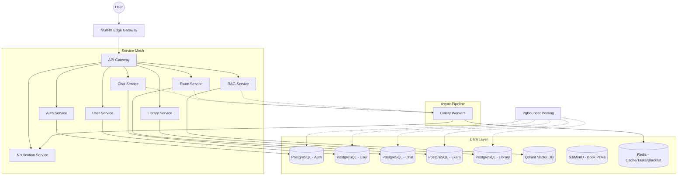
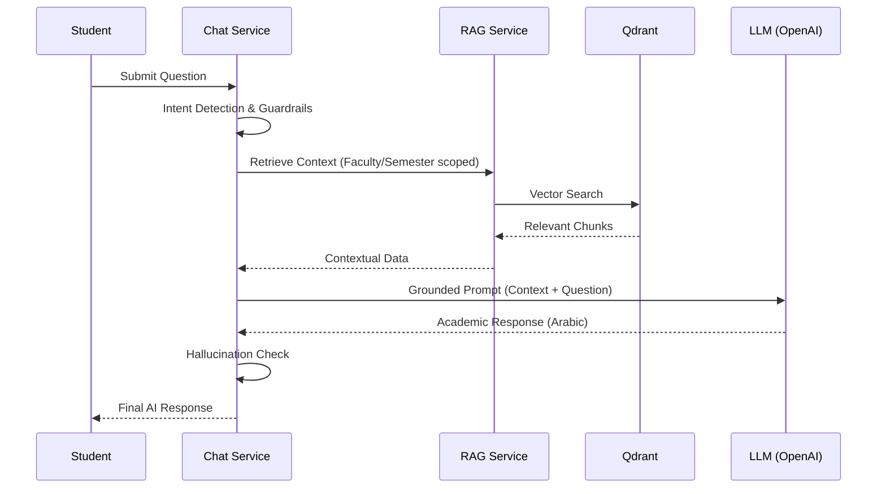
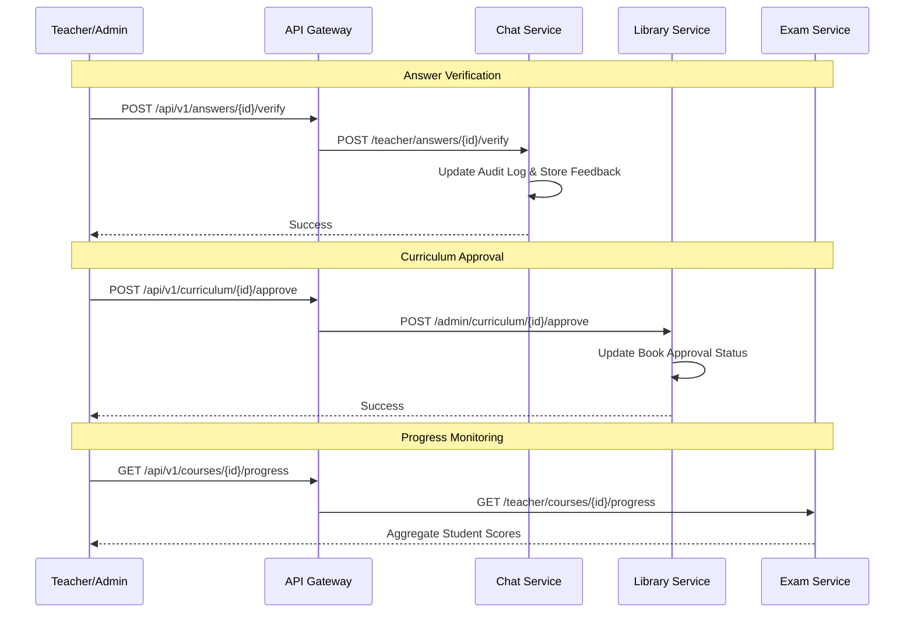

# AI-Teacher Backend: Architecture & Operations Manual

This document provides a comprehensive overview of the AI-Teacher microservices architecture, its deployment strategies, and operational guidelines for a production-grade environment.

---

## 🏗️ 1. System Architecture

The system follows a microservices architecture, designed for high availability, scalability, and security.

### 1.1 Architecture Diagram

### 1.2 RAG Flow & AI Pipeline

### 1.3 RAG AI Confidence & Hallucination Guardrails
The system implements a multi-stage groundedness check:
1. **Retrieval Score**: RAG pipeline calculates cosine similarity (Threshold >= 0.7).
2. **Context sufficiency**: LLM evaluates if the retrieved chunks contain enough information to answer.
3. **Response Validation**: Final response is checked against source chunks for factual consistency.
4. **Teacher Verification**: Teachers manually review answers to provide a ground-truth feedback loop, which is logged and used for system tuning.

### 1.4 Teacher & Admin Workflows

---

## 🛠️ 2. Service Responsibilities

### Core Microservices
| Service | Responsibility | Key Endpoints | Data Store |
| :--- | :--- | :--- | :--- |
| **API Gateway** | RBAC, Rate Limiting, Versioning | `/api/v1/*` | Redis |
| **Auth Service** | Identity, JWT, Role Management | `/login`, `/register`, `/logout`, `/google` | PostgreSQL |
| **User Service** | Profiles, Academic Hierarchy | `/me`, `/faculties`, `/courses` | PostgreSQL |
| **Chat Service** | AI Tutoring, Learning Summary | `/chat`, `/session/{id}` | PostgreSQL |
| **RAG Service** | Vector Search, Document Ingestion | `/search`, `/ingest` | Qdrant, PostgreSQL |
| **Library Service** | Book Management & Secure Delivery | `/admin/books`, `/books/download` | PostgreSQL, S3 |
| **Exam Service** | Async Exam Generation & Grading | `/generate`, `/{id}/submit`, `/teacher/performance` | PostgreSQL |
| **Notification** | Email/FCM Delivery | `/notify` | - |

---

## 🔄 3. CI/CD & Database Lifecycle

### 3.1 CI/CD Workflow
1.  **Code Quality**: Linting with `ruff` and unit testing with `pytest`.
2.  **Security Scanning**: `Trivy` scans for vulnerabilities in dependencies and Docker images.
3.  **Migration Verification**: Automated check ensuring models and Alembic scripts are in sync.
4.  **Automated Migrations**:
    - **Staging/Production**: Migrations are executed as part of the deployment pipeline before service rollout.
    - **Logging**: All applied migrations are logged for traceability.
5.  **Build & Push**: Multi-arch Docker images are pushed to the registry upon successful tests.

### 3.2 Alembic Migration Strategy
- **Idempotency**: All migrations are designed to be safe to run multiple times.
- **Soft-Delete**: All relational tables support `is_deleted` (timestamp) for data recovery and auditing.
- **Strategic Indexing**: Core foreign keys and frequently queried fields (e.g., `user_id`, `course_id`, `session_id`) are indexed to maintain performance at scale.
- **Zero-Downtime**: Schema changes follow a "no-breakage" policy (adding nullable columns first, then migrating data).

---

## 🚦 4. Scaling & Performance Strategy

### 4.1 Target: 100k+ Concurrent Users
- **Horizontal Scaling**: All services are stateless, allowing for 10+ replicas per service.
- **Load Balancing**: NGINX edge handles SSL termination and round-robin load balancing.
- **Database Pooling**: **PgBouncer** is used for transaction-level pooling, allowing thousands of concurrent DB connections with minimal overhead.

### 4.2 Caching Strategy (Redis)
- **Identity**: JWT Blacklist for immediate logout/revocation.
- **OAuth**: Google ID Token verification integrated into the Auth Service.
- **RAG**: Vector search results cached for 10 minutes to reduce LLM/Qdrant load.
- **AI Responses**: Final tutor responses cached for 24h for common queries.

### 4.3 Database Optimization
- **Read Replicas**: All services support `READ_DATABASE_URL` to offload heavy `GET` traffic from the primary write node.
- **Sharding**: Qdrant collections are physically sharded (shard_number=4) to handle massive vector search loads.

---

## 📊 5. Observability & Governance

### 5.1 Centralized Audit Logging
All services implement structured JSON logging for critical events.
- **Mandatory Fields**: `timestamp`, `service_name`, `user_id`, `action`, `metadata`, `request_id`.
- **Critical Events Audited**:
    - User Authentication (Login/Logout/Register)
    - RBAC / Permission Changes
    - Exam Creation & Submissions
    - AI Tutor Queries & RAG Retrievals
    - Admin-level modifications to academic data.

### 5.2 Monitoring Stack
- **Prometheus**: Scrapes metrics from `/metrics` endpoints across all service replicas.
- **Grafana**: Dashboards for visualizing system health, throughput, and error rates.
- **OpenTelemetry**: Distributed tracing for diagnosing latency across microservice boundaries.
- **Alertmanager**: Configured for high error rates or database connection exhaustion.

---

## 🔐 6. Security
- **Non-Root Execution**: All Docker containers run as `appuser`.
- **RBAC**: Enforced at the API Gateway level (SUPER_ADMIN, ADMIN, TEACHER, STUDENT).
- **Data Isolation**: Multi-tenant isolation enforced via `faculty_id` and `semester_id` filters in all RAG and Chat queries. Teachers are strictly restricted to their assigned faculty.
