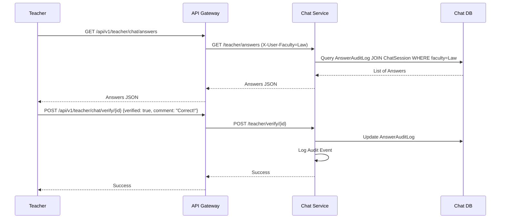

# Teacher Role & Panel Documentation

This document describes the Teacher Role implementation and the Teacher Panel backend functionality.

## 🎯 Objective
Enable teachers to manage and review AI-generated content and monitor student performance without full administrative privileges. Teachers are restricted to the faculty they are assigned to.

## 🔑 Key Features
1. **Review AI Answers**
   - Access AI-generated answers from students in their faculty.
   - Approve or reject answers.
   - Add teacher comments for pedagogical guidance.
2. **Curriculum Management**
   - View, upload, and update books/materials for their faculty.
   - Restricted from modifying other faculties' content.
3. **Student Performance Monitoring**
   - Track aggregate student progress in exams.
   - View AI Confidence Scores (RAG similarity scores) for student queries.

## 🛠️ Implementation Details

### Data Model Updates
In `chat-service`, the `AnswerAuditLog` model now includes:
- `verified_by_teacher`: Boolean indicating teacher review status.
- `teacher_comment`: Text field for teacher feedback.
- `rag_confidence_score`: Float representing the similarity score from the RAG pipeline.

### RBAC & Security
- **API Gateway**: Enforces the `teacher` role and injects the `X-User-Faculty` header into downstream requests.
- **Service Level**: Downstream services (Chat, Library, Exam) check the `X-User-Role` and `X-User-Faculty` to ensure teachers only access data within their scope.

### New API Endpoints

#### Chat Service
| Endpoint | Method | Description | Role |
| :--- | :--- | :--- | :--- |
| `/teacher/answers` | `GET` | Fetch answers for review (faculty scoped) | Teacher, Admin |
| `/teacher/verify/{log_id}` | `POST` | Approve/Reject an answer with comments and tags | Teacher, Admin |
| `/teacher/performance` | `GET` | Get aggregate AI performance stats (confidence, feedback) | Teacher, Admin |

#### Exam Service
| Endpoint | Method | Description | Role |
| :--- | :--- | :--- | :--- |
| `/teacher/performance` | `GET` | Get aggregate exam performance stats (avg score, attempts) | Teacher, Admin |

#### Library Service
| Endpoint | Method | Description | Role |
| :--- | :--- | :--- | :--- |
| `/admin/books` | `POST/PUT/DELETE` | Manage books (restricted to own faculty for teachers) | Teacher, Admin |
| `/admin/books` | `GET` | List books (restricted to own faculty for teachers) | Teacher, Admin |

## 🧪 RBAC Rules
1. **Faculty Isolation**: Teachers can ONLY access data (answers, exams, books) where the `faculty_id` matches their own `X-User-Faculty-Id`.
2. **Action Restrictions**:
   - Teachers CAN upload/delete books in their faculty.
   - Teachers CANNOT create new faculties or departments (Admin only).
   - Teachers CAN verify student answers.
   - Teachers CAN view performance statistics.

## 📡 API Examples

### Fetch Answers for Review
**Request**: `GET /api/v1/teacher/chat/answers`
**Headers**: `Authorization: Bearer <token>`, `X-User-Faculty-Id: <uuid>`

**Response**:
```json
[
  {
    "id": "uuid-1",
    "user_id": "student-uuid",
    "question_text": "What is the capital of France?",
    "ai_answer": "The capital is Paris.",
    "rag_confidence_score": 0.98,
    "verified_by_teacher": false,
    "teacher_comment": null,
    "is_correct": true
  }
]
```

### Verify Answer
**Request**: `POST /api/v1/teacher/chat/verify/uuid-1`
**Body**:
```json
{
  "verified": true,
  "comment": "Perfect answer!",
  "custom_tags": ["high-quality", "accurate"]
}
```

## 📊 Audit Logging
All teacher actions are logged in the structured audit trail with `request_id` for full traceability.
- **Action**: `teacher_verify`, `BOOK_UPLOADED`, `BOOK_UPDATED`, `BOOK_DELETED`.
- **Metadata**: Includes verification status, comments, tags, and book details.

## 🔄 Sequence: Teacher Review Flow

