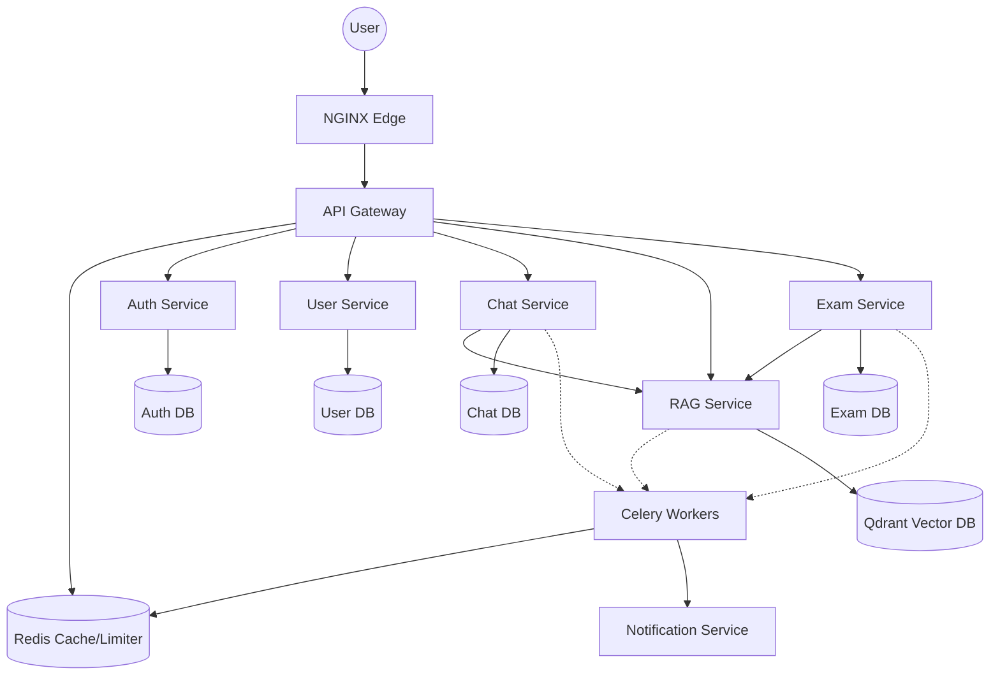

# AI-Teacher Production Microservices Architecture

## 🏗️ Architecture Overview

## 🛠️ Service Responsibilities & Endpoints

### 1. Auth Service
- **Purpose**: Identity and Access Management.
- **Endpoints**:
  - `POST /auth/register`: Create new student/academic accounts.
  - `POST /auth/login`: Issue JWT access and refresh tokens.
  - `POST /auth/logout`: Revoke sessions via Redis blacklist.
  - `POST /auth/refresh`: Renew expired access tokens.
- **Database**: PostgreSQL (`auth_db`).

### 2. User Service
- **Purpose**: Academic hierarchy and user profiles.
- **Endpoints**:
  - `GET /faculties`: List available faculties.
  - `GET /me`: Retrieve current user profile.
  - `PUT /me`: Update profile (Faculty, Department, Semester).
- **Database**: PostgreSQL (`user_db`).

### 3. Chat Service (AI Tutor)
- **Purpose**: Orchestrate AI tutoring sessions using RAG and pedagogical guardrails.
- **Endpoints**:
  - `POST /chat`: Submit a message and get an AI response.
  - `DELETE /session/{id}`: Soft-delete a chat session.
- **Database**: PostgreSQL (`chat_db`).
- **Background Jobs**: Async learning state summarization to optimize LLM context.

### 4. RAG Service
- **Purpose**: Document ingestion, chunking, and semantic search.
- **Endpoints**:
  - `POST /search`: Vector search across curriculum content with Faculty/Semester isolation.
  - `POST /ingest`: Upload PDF for chunking and embedding.
- **Databases**: Qdrant (Vectors), PostgreSQL (Metadata/Alembic).
- **Background Jobs**: Async PDF processing and embedding generation via Celery.

### 5. Exam Service
- **Purpose**: Automated exam generation from course material.
- **Endpoints**:
  - `POST /generate`: Trigger async exam generation (MCQ & Theory).
  - `GET /{id}`: Retrieve generated exam questions.
- **Database**: PostgreSQL (`exam_db`).
- **Background Jobs**: Async LLM-based exam creation via Celery.

### 6. Notification Service
- **Purpose**: Async delivery of system events.
- **Database**: None (Stateless).
- **Jobs**: Send Email/FCM notifications via Celery.

## 🚦 Scale & Performance Strategy

### Horizontal Scaling
- **Target**: 100k+ concurrent users.
- **Replication**: All services are stateless and run with 3-10+ replicas behind NGINX.
- **Load Balancing**: NGINX uses round-robin for internal service mesh.

### Database Hardening
- **PgBouncer**: All relational services connect via PgBouncer (port 6432) for transaction pooling, supporting 10k+ active database connections.
- **Read Replicas**: Services use `ReadSessionLocal` to route `GET` requests to PostgreSQL read replicas, offloading the primary write node.
- **Migrations**: Alembic migrations are executed on startup via `entrypoint.sh` and verified in CI. See [MIGRATION_GUIDE.md](./MIGRATION_GUIDE.md).

### Standardized Caching
- **Redis Strategy**:
  - **Auth**: Token blacklist (TTL = token expiry).
  - **RAG**: Vector search results (TTL = 10m).
  - **LLM**: Final AI responses (TTL = 6h-24h depending on content).
  - **Rate Limiting**: Per-user sliding window limits.

### Async Pipeline
- Heavy operations (PDF ingestion, Exam generation) are offloaded to **Celery** workers using **Redis** as a broker. This prevents blocking the main API threads.

## 🔐 Security & Governance
- **API Gateway**: Enforces JWT validation, RBAC (`admin`, `academic`, `student`), and per-user rate limiting.
- **Audit Logging**: All critical events (Auth, Exams, RAG Ingestion, AI Queries) are logged in structured JSON for compliance.
- **Academic Context**: Services enforce `faculty_id` and `semester_id` filters to prevent cross-tenant data leakage.

## 🛠️ CI/CD Workflow
1.  **Lint & Test**: Code quality checks with Ruff and unit testing.
2.  **Migration Verification**: Runs `alembic upgrade head` and `alembic downgrade base` in a test environment to ensure migration integrity.
3.  **Security Scan**: Dependency and Docker image vulnerability scanning with Trivy.
4.  **Build & Push**: Builds multi-arch Docker images and pushes to registry.

## 🚀 Deployment Notes
- All services run as non-root users (`appuser`).
- Use `docker-compose.yml` in the `microservices/` directory for local or production-like orchestration.
- Ensure all environment variables in `.env` are set correctly, especially `JWT_SECRET_KEY` and `OPENAI_API_KEY`.
